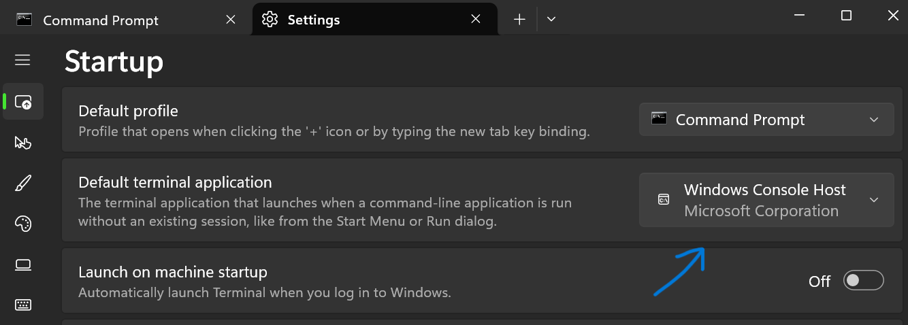
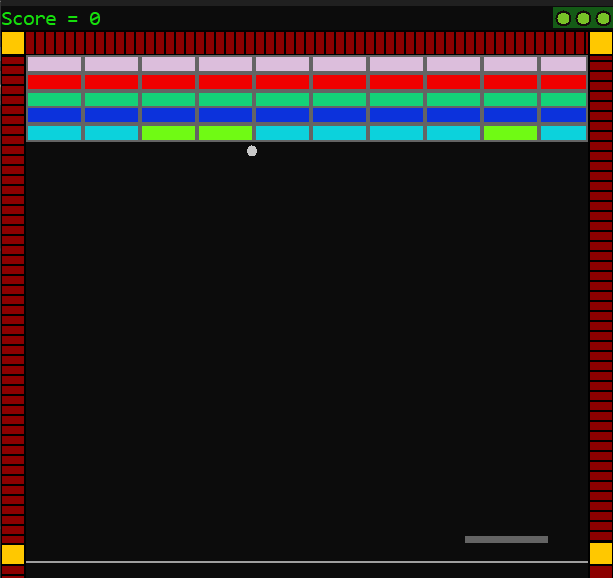

# Brick Breaker in C++

This is a simple console-based Brick Breaker game implemented in C++. It provides a classic gaming experience where players control a paddle to bounce a ball and break bricks.

## Features

- Control a paddle to bounce a ball and break bricks.
- Different levels of difficulty with varying brick configurations.
- Score tracking to keep track of player performance.
- Lives system to manage player's attempts.
- Game over screen with option to restart or exit.

## important notice
 the game will not show graphics in windows terminal you have to use windows console host to play the game by changing default terminal in setting of cmd or terminal of windows as shown below

 

 **Recommended size of window** : 
 - height(30) and width(68)

## How to Play

1. **Controls**:
   - Use the left and right arrow keys to move the paddle.
   - Press 'Space' to launch the ball at the start of the game and to continue after losing a life.

2. **Objective**:
   - Break all the bricks on the screen by bouncing the ball with the paddle.
   - Avoid letting the ball fall below the paddle. Lose a life when the ball falls off the screen.

3. **Scoring**:
   - Earn points for breaking bricks. The score increases with each brick broken.
   - Bonus points may be awarded for breaking multiple bricks in quick succession.

4. **Lives**:
   - Start the game with a set number of lives.
   - Lose a life each time the ball falls off the screen.
   - Game ends when all lives are lost.

## Gameplay Screenshot

## Installation

1. Clone the repository to your local machine: https://github.com/maazkhan75/Brick-Breaker.git

